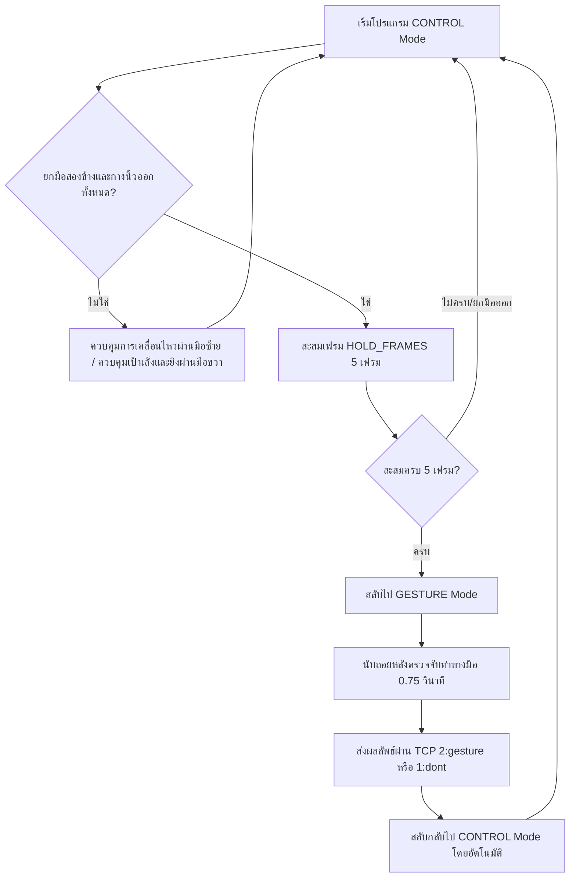

# คู่มือและโครงสร้างโปรเจค (Gesture Controller Agent Documentation)

ยินดีต้อนรับสู่คู่มือการทำงานของโปรเจค **Gesture Controller** ซึ่งเป็นระบบควบคุมการทำงานของแอปพลิเคชันหรือเกม (เช่น Unity) ผ่านท่าทางของมือ (Hand Gestures) โดยตรวจจับจากกล้องเว็บแคม (Webcam) ด้วย **MediaPipe Hands** และแยกแยะประเภทท่าทางด้วย **Machine Learning (Scikit-Learn Classifier)**

โปรเจคนี้ประกอบไปด้วยสองโหมดหลักคือ **CONTROL Mode (ใช้ควบคุมการเคลื่อนไหวและมุมมอง)** และ **GESTURE Mode (ใช้เลือกหรือปล่อยสกิลจากท่าทางมือพิเศษ)**

---

## 📂 โครงสร้างไฟล์ในโปรเจค (File Structure)

- 📄 **[main.py](file:///c:/Users/comsc/best_project/GestureController/main.py)**: ไฟล์หลักในการรันระบบ ตรวจจับมือผ่านกล้อง ประมวลผลโหมด จัดการส่งข้อมูลผ่าน TCP และ UDP รวมถึงทำนายท่าทางจาก Model
- 📄 **[savevalue.py](file:///c:/Users/comsc/best_project/GestureController/savevalue.py)**: สคริปต์เสริมสำหรับใช้เก็บรวบรวมพิกัดมือ (Landmarks) ไปยังไฟล์ CSV เพื่อสร้างเป็น Dataset สำหรับนำไปสอน (Train) โมเดลเพิ่ม
- 📦 **[model.pkl](file:///c:/Users/comsc/best_project/GestureController/model.pkl)**: โมเดล Machine Learning ที่ผ่านการเทรนเสร็จแล้ว (ประกอบด้วย `model`, `le` (LabelEncoder), และ `scaler`)
- 📄 **[env.txt](file:///c:/Users/comsc/best_project/GestureController/env.txt)**: รายการแพ็คเกจ Python ที่จำเป็นต้องติดตั้ง (`opencv-python`, `mediapipe`, `scikit-learn==1.6.1`)

---

## ⚙️ ระบบการสื่อสารของโปรเจค (Communication Systems)

ระบบทำหน้าที่ส่งสถานะและการเคลื่อนไหวไปให้ฝั่งผู้รับข้อมูล (เช่น Unity) ผ่าน Network Sockets สองโปรโตคอลเพื่อตอบสนองอย่างรวดเร็วและแม่นยำ:

### 1. UDP (Control Data - ส่งคำสั่งเคลื่อนไหวและมุมมอง)
- **Host / Port**: `127.0.0.1:5006`
- **ลักษณะการสื่อสาร**: ส่งข้อมูลแบบไร้การเชื่อมต่อ (Connectionless) เพื่อความรวดเร็วและไม่มีดีเลย์ (Low Latency)
- **โครงสร้างข้อความ**: `L:<left_state>\nR:<right_state>` (แบ่งบรรทัดระหว่างมือซ้ายและขวา)
  - ป้องกันการสแปม (Spam prevention): จะส่งข้อมูลออกไปเฉพาะเมื่อสถานะเคลื่อนไหวเปลี่ยนเท่านั้น

### 2. TCP (Gesture & Mode Data - ส่งข้อมูลโหมดและประเภทท่าทาง)
- **Host / Port**: `localhost:5005` (Python ทำหน้าที่เป็น TCP Server รอให้ Unity มาเชื่อมต่อ)
- **ลักษณะการสื่อสาร**: ส่งข้อมูลแบบรับรองความถูกต้องสูง (Reliable Connection) เพื่อป้องกันการสูญหายของข้อความสั่งการสำคัญ
- **โครงสร้างข้อความ**:
  - `0:<mode>`: แจ้งเตือนการสลับโหมด เช่น `0:control` หรือ `0:gesture`
  - `1:<status>`: แจ้งสถานะทั่วไปของท่าทาง เช่น `1:dont` (ไม่มีผลลัพธ์ที่ถูกต้อง)
  - `2:<gesture>`: ส่งเมื่อสรุปท่าทางจากโมเดลได้ เช่น `2:rabbit`, `2:bird`, `2:frog`

---

## 🕹️ โหมดการทำงาน (Operation Modes)



### 1. CONTROL Mode (โหมดควบคุม)
ใช้ตรวจจับมือซ้ายและขวา เพื่อควบคุมคำสั่งที่แตกต่างกัน:

*   **มือซ้าย (ควบคุมทิศทาง / เคลื่อนที่ - Joystick)**
    *   **เงื่อนไขการเปิดใช้งาน**: ระบบจะถือว่าพร้อมคุมเมื่อกำมือหรือนิ้วหุบลง (มีนิ้วปิดอยู่อย่างน้อย 4 นิ้วขึ้นไป)
    *   **ตรรกะการคุม**: ใช้ตำแหน่งข้อมือ/กลางฝ่ามือเปรียบเทียบกับจุดกึ่งกลางจอยสติ๊กจำลองบนฝั่งซ้ายของจอ (`(160, 240)`)
    *   **การกรองสัญญาณ**: ใช้ **Exponential Moving Average (EMA)** ด้วยค่า `EMA_ALPHA = 0.25` เพื่อช่วยลดการสั่นของพิกัดมือ
    *   **สถานะที่ส่ง (`left_state`)**:
        *   `Idle`: อยู่ในวงขอบ Deadzone หรือไม่ได้กำมือ
        *   `MoveLeft` / `MoveRight`: เลื่อนมือออกซ้ายหรือขวาจากจุดกึ่งกลาง
        *   `Jump` / `Crouch`: เลื่อนมือขึ้นหรือลงจากจุดกึ่งกลาง

*   **มือขวา (ควบคุมการเล็งเป้าและยิง - Aim & Shoot)**
    *   **ชี้เพื่อเล็งทิศทาง**: ใช้เวกเตอร์ความสัมพันธ์จากโคนนิ้วชี้ไปยังปลายนิ้วชี้เพื่อหาทิศทางการชี้
    *   **สถานะที่ส่ง (`right_state`)**: `AIM_UP`, `AIM_DOWN`, `AIM_LEFT`, `AIM_RIGHT`
    *   **บีบมือเพื่อยิง (Pinch to Shoot)**: เมื่อระยะระหว่างปลายนิ้วชี้และปลายนิ้วโป้งมีขนาดต่ำกว่าเกณฑ์ (`hand_scale * 0.35`) ระบบจะทำการส่งสถานะพิเศษขึ้นเป็น **SHOOT** (ส่ง `AIM_UP` ไปที่ UDP พร้อมแสดงเอฟเฟกต์สีแดงที่หน้าจอ)

---

### 2. GESTURE Mode (โหมดแยกแยะท่าทาง)
โหมดแยกแยะท่าทางมือพิเศษโดยประมวลผลผ่านโมเดล Machine Learning ในช่วงเวลาจำกัด:

*   **การสลับเข้าสู่โหมด**: ยกมือสองข้างกางนิ้วออก (Open Hand) ค้างไว้เป็นเวลา 5 เฟรม (`HOLD_REQUIRED`)
*   **การทำงาน**:
    1.  ระบบจะจับเวลาทดไว้ `0.75 วินาที` (`GESTURE_DURATION`) เพื่อให้ผู้ใช้ทำท่าทาง
    2.  ในแต่ละเฟรม ระบบจะตรวจจับจุดเชื่อมต่อมือ (Hand Landmarks) ของแต่ละมือ
    3.  **การปรับพิกัด (Normalization)**: พิกัด x, y ของแลนด์มาร์ก 21 จุดจะถูกดึงออกมาและปรับอัตราส่วนเทียบกับความกว้าง-สูงของ Bounding Box ของมือนั้นๆ เพื่อเพิ่มความแม่นยำในการทำนายแม้ขนาดมือจะอยู่ใกล้/ไกลกล้องต่างกัน
    4.  หากตรวจเจอมือเพียงข้างเดียว ระบบจะใส่ค่าเป็น `0.0` จำนวน 63 พิกัด (Padding) เพื่อให้ Vector ข้อมูลคงที่ขนาด 126 ค่า
    5.  ส่งพิกัดผ่านการสเกล (`scaler`) และโยนเข้าทำนายในโมเดล (`predict_proba`)
    6.  **ระบบโหวตคะแนน**: หากความมั่นใจในการทำนาย (Confidence) มากกว่าหรือเท่ากับ `0.5` ผลลัพธ์จะถูกนำไปเก็บแต้มโหวต
    7.  **สรุปผลลัพธ์**: เมื่อครบเวลา 0.75 วินาที ระบบจะเลือกท่าที่ได้โหวตมากที่สุดส่งผ่าน TCP (เช่น `2:rabbit`) แล้วคืนค่าสลับเข้าสู่โหมด `CONTROL` ทันที

---

## 📊 การรวบรวมชุดข้อมูลด้วย `savevalue.py`

สำหรับการเทรนท่าทางมือใหม่ๆ สามารถใช้ไฟล์ `savevalue.py` ได้ดังนี้:

1.  เปิดไฟล์และกำหนดประเภทท่าทางที่ต้องการบันทึกที่ตัวแปร `GESTURE_NAME` (บรรทัดที่ 17 เช่น `"frog"`, `"rabbit"`)
2.  เมื่อรันสคริปต์ หน้าจอตรวจจับมือจะแสดงขึ้นมา
3.  กด **SPACEBAR** เพื่อสลับสถานะเริ่มบันทึกข้อมูลพิกัดแลนด์มาร์ก (แสดงคำว่า `REC`) หรือพักหยุดบันทึก (`PAUSE`)
4.  สคริปต์จะคำนวณพิกัดมือตาม Bounding Box และแปลงเป็นแบบ Normalized จากนั้นเขียนลงไปที่ไฟล์ `dataset.csv`
5.  กดคีย์ **Q** เพื่อออกจากโปรแกรมและเซฟไฟล์ dataset

---

## 🛠️ ความต้องการและการรันโปรเจค (Setup & Execution)

### 1. การติดตั้งไลบรารี
ตรวจสอบให้แน่ใจว่าติดตั้งโมดูลต่างๆ ตามที่ระบุไว้ใน `env.txt`:
```bash
pip install opencv-python mediapipe scikit-learn==1.6.1
```

### 2. การเริ่มใช้งานระบบควบคุม
รันระบบประมวลผลหลักโดยเรียกใช้คำสั่ง:
```bash
python main.py
```
> [!NOTE]
> ระบบจะแสดงข้อความ `[TCP] Waiting for Unity at localhost:5005 ...` บน Terminal จนกระทั่งฝั่ง Unity มีการเชื่อมต่อเข้ามาเป็นผลสำเร็จ จากนั้นหน้าจอแสดงภาพกล้องหลักจะเปิดขึ้นมาเพื่อให้เริ่มคุมได้ทันที
